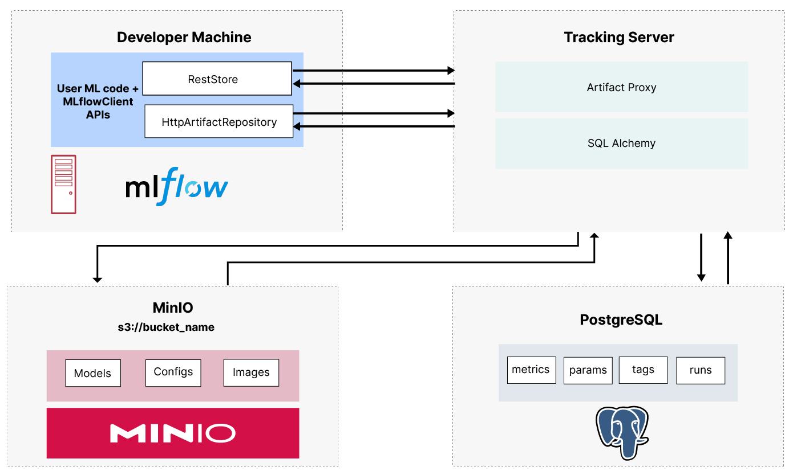

# MLOps Experiment Tracking with MLflow and MinIO

A comprehensive MLOps project demonstrating machine learning experiment tracking using MLflow for experiment management and MinIO for artifact storage.

> 📖 Based on [MLflow Tracking and MinIO Blog Post](https://blog.min.io/mlflow-tracking-and-minio/)

## Overview


This project explores the complete MLOps workflow for machine learning experiments, focusing on:

- **Experiment Tracking**: Using MLflow to log parameters, metrics, and results
- **Artifact Management**: Storing models and datasets in MinIO object storage
- **Reproducible ML**: Managing the complete machine learning lifecycle

Following the methodology outlined in the [MLflow Tracking and MinIO blog post](https://blog.min.io/mlflow-tracking-and-minio/), this project demonstrates best practices for tracking ML experiments at scale.

## Architecture

The project uses the following stack:

- **MLflow**: Experiment tracking and model management
- **MinIO**: Object storage for artifacts and datasets
- **PostgreSQL**: Metadata store for MLflow
- **PyTorch**: Deep learning framework
- **Docker Compose**: Service orchestration



## Features

### MLflow Tracking Components

- **Parameters**: Learning rates, epochs, model architecture
- **Metrics**: Loss functions, accuracy scores, training metrics
- **Artifacts**: Trained models, datasets, visualizations
- **Experiments**: Organized collections of related runs

### Experiment Management

- Track hyperparameter tuning experiments
- Compare model performance across runs
- Visualize training metrics and loss curves
- Store and version datasets and models

## Quick Start

### Prerequisites

- uv 
- Docker and Docker Compose
- Git

### Setup

After cloning the repository:

   ```bash
   make install
   make docker-up
   ```

This starts:

- MLflow Tracking Server (<http://localhost:5010>)
- MinIO Object Storage (<http://localhost:9000>)
- PostgreSQL Database

### Running Experiments

tp://localhost:5000](http://localhost:5000) to explore the MLflow UI.

## Project Structure

```
.
├── config.env
├── docker-compose.yml
├── docs
│   └── ml-flow-architecture.jpg
├── main.py
├── Makefile
├── mlflow
│   └── Dockerfile
├── notebooks
│   ├── __marimo__
│   │   └── cache
│   ├── __pycache__
│   │   └── mnist_training.cpython-313-pytest-8.4.1.pyc
│   ├── data
│   │   └── mnistdata
│   │       └── MNIST
│   └── mnist_training.py
├── pyproject.toml
├── README.md
├── uv.lock
└── wait-for-it.sh
```

## MLflow Tracking APIs Used

### Setup APIs

- `mlflow.set_tracking_uri()` - Connect to MLflow server
- `mlflow.set_experiment()` - Set active experiment
- `mlflow.start_run()` - Begin experiment run
- `mlflow.end_run()` - Complete experiment run

### Logging APIs

- `mlflow.log_params()` - Log hyperparameters
- `mlflow.log_metric()` - Log individual metrics
- `mlflow.log_metrics()` - Log multiple metrics
- `mlflow.log_artifacts()` - Store files and datasets
- `mlflow.pytorch.log_model()` - Store trained models

## Example Experiments

### MNIST Digit Classification

The project includes experiments on the MNIST handwritten digit dataset:

- **Dataset**: 60,000 training images, 10,000 test images
- **Model**: 3-layer neural network with ReLU activation
- **Goal**: Achieve >98% accuracy through hyperparameter optimization


### Results Visualization

The MLflow UI provides:

- **Table View**: Compare runs side-by-side
- **Chart View**: Visualize parameter vs. metric relationships
- **Artifact View**: Access stored models and datasets

## MinIO Integration

All artifacts are automatically stored in MinIO:

- **Models**: Serialized PyTorch models with metadata
- **Datasets**: Raw and preprocessed data files
- **Visualizations**: Training curves and model diagrams

**MinIO Console**: [http://localhost:9001](http://localhost:9001)
Credentials are found in `config.env`

## Configuration

### Environment Variables

See `config.env`

### MLflow Configuration
```python
import mlflow
import os

mlflow.set_tracking_uri(os.getenv("MLFLOW_TRACKING_URI"))
mlflow.set_experiment("mnist-classification")
```

## Usage

### Tracking experiments

```python
import mlflow
from src.training.trainer import Trainer
from src.models.neural_network import MNISTNet

# Start experiment
with mlflow.start_run(run_name="custom-experiment"):
    # Log parameters
    mlflow.log_params({
        "learning_rate": 0.01,
        "epochs": 50,
        "model_type": "3-layer-nn"
    })
    
    # Train model
    model = MNISTNet(784, 128, 10)
    trainer = Trainer(model)
    metrics = trainer.train()
    
    # Log results
    mlflow.log_metrics(metrics)
    mlflow.pytorch.log_model(model, "model")
```

### Comparing Experiments

Use the MLflow UI to:
1. Select multiple runs
2. Create comparison charts
3. Analyze parameter impact on performance
4. Export results for reporting

### Deployment

For serving, we can do the following to have a local running inference service (see [MLFlow Deployment](https://mlflow.org/docs/latest/ml/deployment/) for more)

```bash
# We set the tracking uri to the remote mlflow server
export MLFLOW_TRACKING_URI=http://localhost:5010/

# We run the following command to have a local inference service
mlflow models serve -m models:/mnist_classifier/6 --port 5015 --no-conda
```


## References

- [MLflow Tracking and MinIO Blog Post](https://blog.min.io/mlflow-tracking-and-minio/)
- [MLflow model registry and MinIO blog post](https://blog.min.io/mlflow-model-registry-and-minio/)
- [Original Code Examples](https://github.com/minio/blog-assets/tree/main/mlflow_tracking)
- [MLflow Documentation](https://mlflow.org/docs/latest/index.html)
- [MinIO Documentation](https://docs.min.io/)

## License

[MIT License](LICENSE) - see LICENSE file for details.

---

**Next Steps:**

- Explore MLflow Model Registry for model deployment
- Implement automated hyperparameter tuning